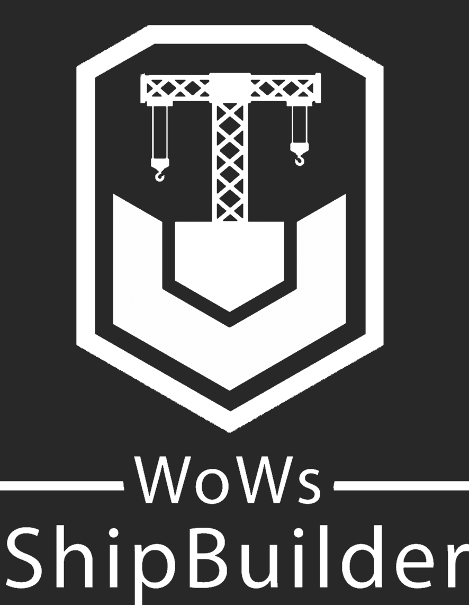

# WoWs-ShipBuilder

  

## General Information

WoWs ShipBuilder is a tool that makes creating and sharing ship configurations (commonly referred to as builds) easy.

If you know the popular WoWs Fitting Tool, you know the basics of what our application does.

So why do you need the ShipBuilder instead of the existing tools?

With the ShipBuilder it is easy to save and load your builds. It comes with a simple and structured UI, grouping relevant elements while still clearly separating different components.

You can either share builds with others or just store them and access them later again. The tool will automatically save your last builds so you don't have to use any external tools or notes to store your builds.

It comes with a nice dark mode and includes some additional features like visualizing the turret angles of a ship or showing the dispersion graphs for one or more ships.

The application is distributed using Velopack, an automatic installer and updater that will install the application and keep it up to date after the first installation.
Update checks only run on application startup so it won't mess up your system with unnecessary services. The application itself is stored in your local app data and installation should not require admin permissions.

**WARNING**: You may get a Windows SmartScreen warning or a warning from your AV software when installing the tool. This is due to the distributed binary being unsigned. Unfortunately, code-signing certificates are rather expensive so we are not able to sign our binary at the moment.

## Telemetry data and error reports

We do not collect any personal data in our application because it's simply not necessary for the app to work.
However, we do automatically collect error reports.
If the application encounters an error, it automatically sends a report to [Sentry](https://sentry.io/) containing the error data. This data does not contain IP addresses or other personal information.
An error is not always visible for you as most errors should be caught internally and handled using fallback actions.

## Latest Release
You can find the latest version download at: https://github.com/WoWs-Builder-Team/WoWs-ShipBuilder/releases/latest. Download the setup.exe and you will be able to install the app.

## Translation help
If you want to see the program translate in your language, you can follow the guide you can find [here](https://github.com/WoWs-Builder-Team/WoWs-ShipBuilder/blob/main/.github/Translation%20guide.md#how-to-help-with-the-translation).

## Donation
Hosting the server where we store the data used by the program has a monthly cost. If you like the program and would like to help us out, you can donate at https://ko-fi.com/wowsshipbuilder. The app will always be free and with no ads. When you donate, you will also get a special role in our discord server.

## Discord
We have a discord server that you can join by clicking [here](https://discord.gg/C8EaepZJDY) .

## Sponsorships and Support

Product subscriptions provided by JetBrains through their [Open Source Support](https://jb.gg/OpenSourceSupport)

Free Open-Source subscription of their localization solution provided by [Crowdin](https://crowdin.com/)

Free Open-Source subscription provided by [Sentry](https://sentry.io/)
